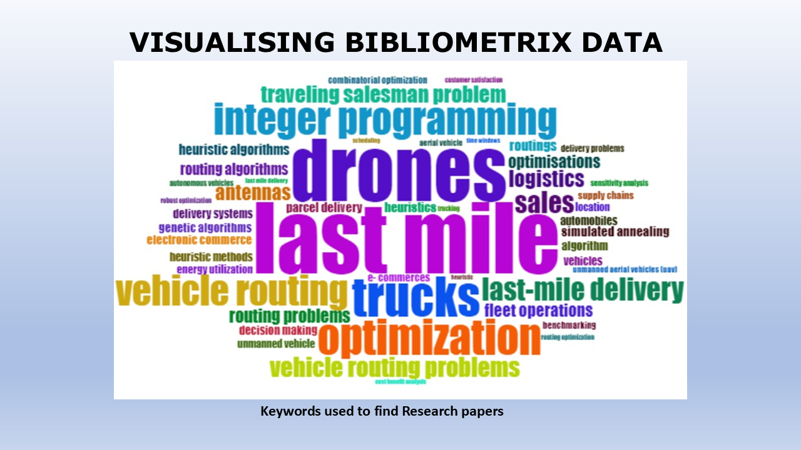
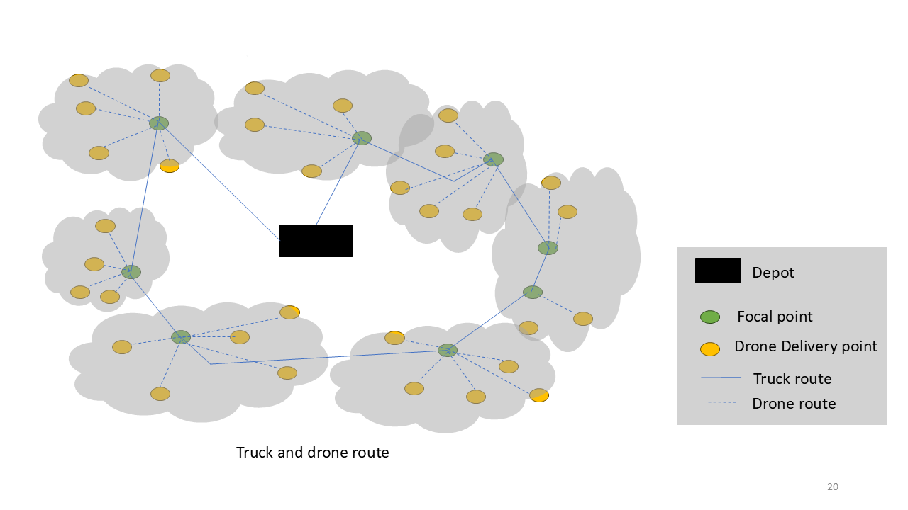
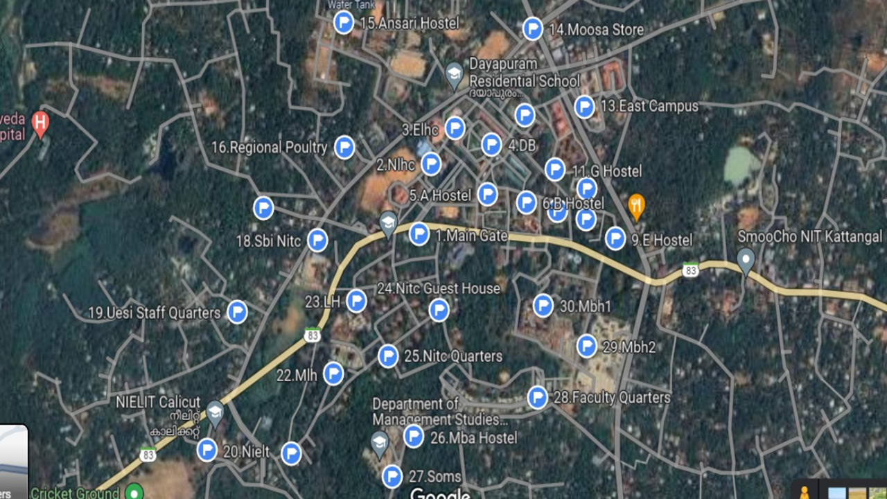
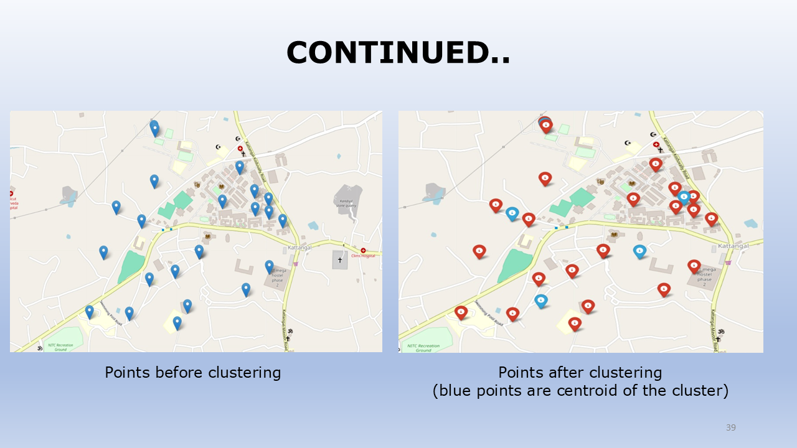
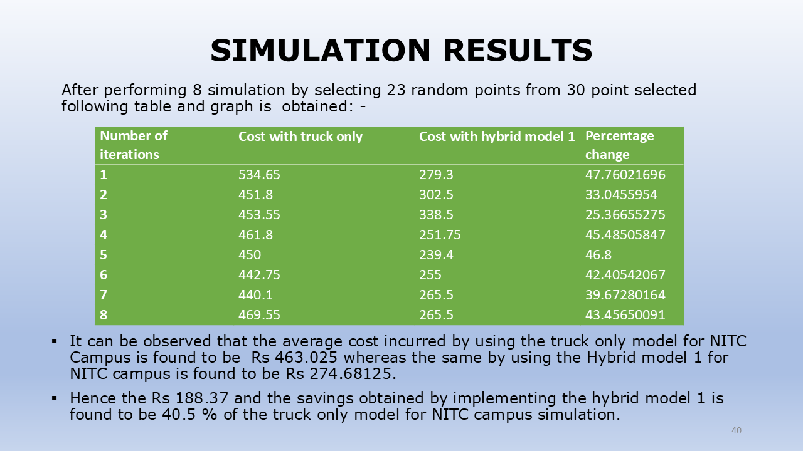

# Hybrid-Truck-Drone-Routing-problem
My Final year project at NIT Calicut
# Project Presentation Preview

Here is a selection of key slides from the project presentation.

---
### Slide 1: Title

---
### Slide 11: System Architecture

---
### Slide 20: Methodology

---
### Slide 23: Data Preprocessing

---
### Slide 36: Model Training

---
### Slide 39: Results

---
### Slide 40: Conclusion

